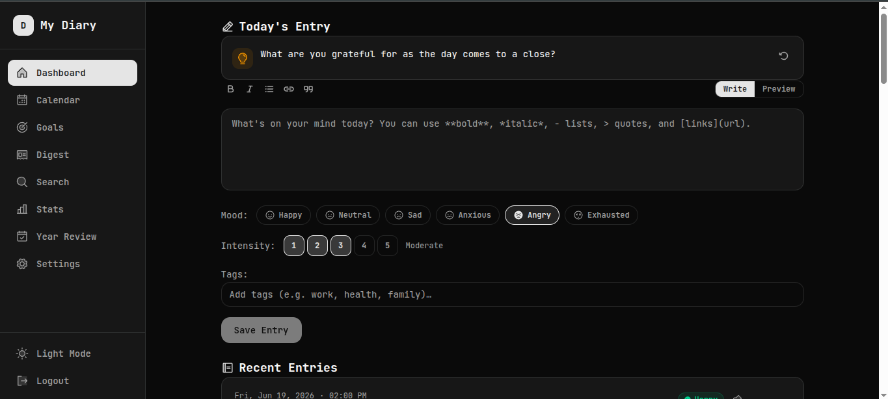
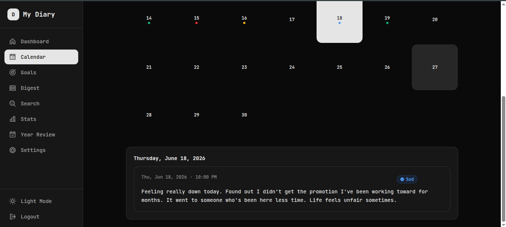
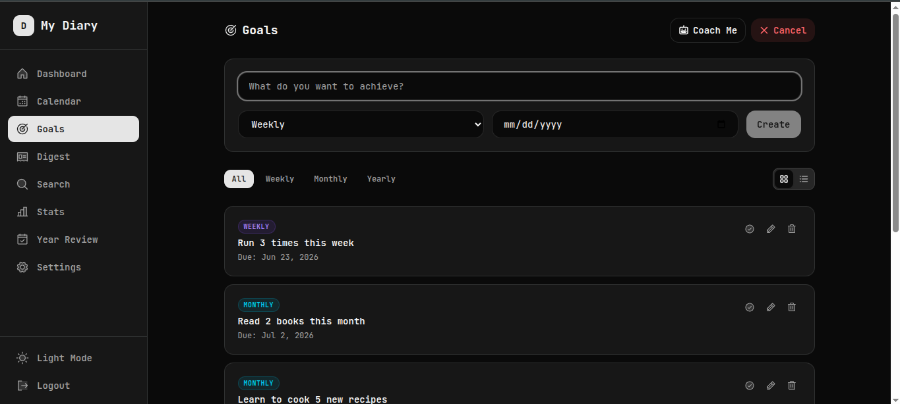
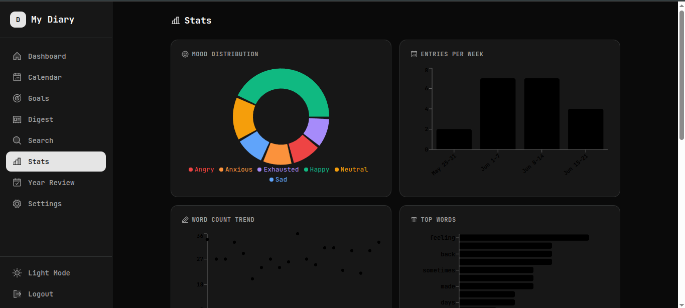
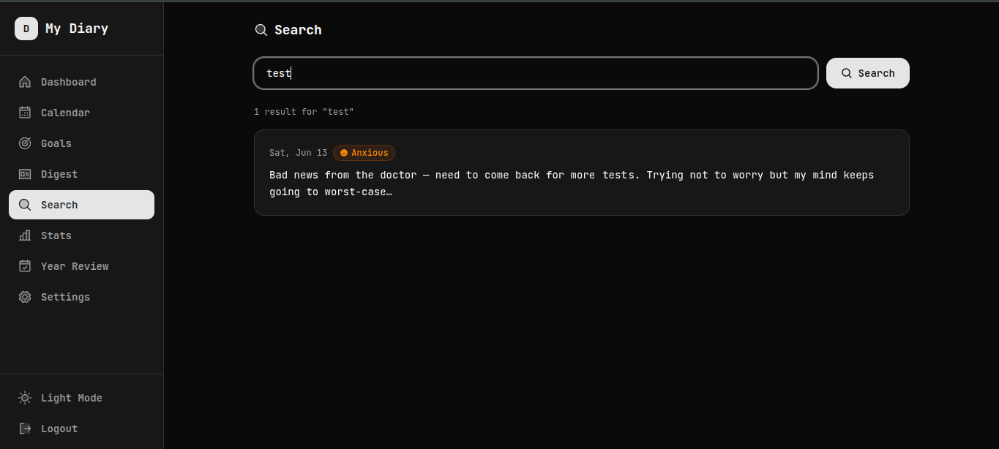
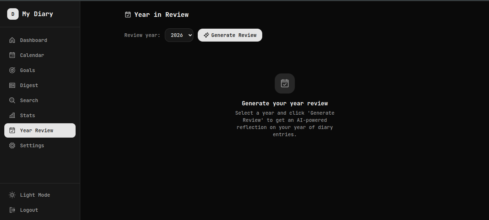

# My Diary

AI-powered personal diary with emotion tracking, goal coaching, analytics, and full-text search. Built for a single user.

## Screenshots

| Dashboard | Calendar | Goals |
|-----------|----------|-------|
|  |  |  |

| Stats | Search | Year Review |
|-------|--------|-------------|
|  |  |  |

## Stack

- **Frontend**: React 19 + Vite 8, React Router 7, TanStack Query 5, Tailwind CSS 4, shadcn/ui
- **Backend**: Express 5 + SQLite (better-sqlite3)
- **AI**: OpenAI GPT-4o-mini (coach, digest, year review)
- **Charts**: Recharts
- **Markdown**: react-markdown + remark-gfm
- **Forms**: react-hook-form + Zod validation
- **State**: Zustand (global UI), TanStack Query (server state)
- **Auth**: Bearer token, single-user (default password: `admin`)

## Getting Started

```bash
# Install dependencies
npm install

# Terminal 1 — Start the backend API
npm run dev:server

# Terminal 2 — Start the Vite dev server
npm run dev
```

Open **http://localhost:5173** in your browser. Log in with `admin`.

## Production

```bash
npm run build
npm start
```

Single command, port 3000 — serves the API and the built React SPA.

## Features

### Core
- **Diary Entries** — Write, edit, delete entries with markdown support (bold, italic, lists, links, quotes)
- **Mood Tracking** — 6 moods (happy, neutral, sad, anxious, angry, exhausted) with 1-5 intensity scale
- **Tags** — Add hashtags to entries, filter by tag in search
- **Pin Entries** — Bookmark important entries, pinned shown first
- **Auto-Save Drafts** — Entry drafts saved to localStorage, restored on revisit

### Views
- **Dashboard** — Write entries + view recent, writing streak counter, mood-aware writing prompts
- **Calendar** — Month grid with color-coded mood dots (scaled by intensity), click to view/edit entries
- **Goals** — Create weekly/monthly/yearly goals, card view + timeline view, deadline tracking
- **Stats** — Analytics dashboard with 6 charts: mood distribution, entries/week, word count trends, top words, goal completion, mood heatmap
- **Search** — SQLite FTS5 full-text search with BM25 relevance ranking, snippet highlighting, tag filtering

### AI Features (requires OpenAI API key)
- **AI Goal Coach** — Reviews your entries against goals, gives personalized coaching
- **Weekly Digest** — AI-generated summary of mood trends, themes, and highlights
- **Year in Review** — Narrative story of your year in moods, words, and moments

### Settings
- **Dark Mode** — Toggle with persistence
- **Change Password** — Secure password update
- **Data Export** — Download all entries, goals, and settings as JSON
- **Data Import** — Restore from JSON backup (merge or replace mode)

## Project Structure

```
src/
  api.js                    # Fetch wrapper with auth
  App.jsx                   # Route definitions
  contexts/AuthContext.jsx   # Token state + login/logout
  stores/useDiaryStore.js   # Zustand store (sidebar, dark mode)
  hooks/useAutoSave.js      # localStorage draft auto-save
  lib/
    moods.js                # Mood config (single source of truth)
    schemas.js              # Zod validation schemas
    utils.js                # cn() helper, parseDate()
    prompts.js              # Writing prompt bank (52 prompts)
  components/
    EntryCard.jsx           # Entry display with edit/pin/tags
    GoalCard.jsx            # Goal card with actions
    GoalTimeline.jsx        # Timeline view for goals
    MoodBadge.jsx           # Mood pill with intensity
    MoodDot.jsx             # Calendar mood dot
    TagInput.jsx            # Hashtag input component
    MarkdownContent.jsx     # Markdown renderer
    MarkdownToolbar.jsx     # Editor toolbar
    WritingPromptCard.jsx   # Mood-aware prompt suggestions
    StreakBadge.jsx         # Writing streak counter
    CoachReport.jsx         # AI coaching report card
    EmptyState.jsx          # Reusable empty state
    ProtectedRoute.jsx      # Auth guard
  pages/
    LoginPage.jsx           # Password login
    DashboardPage.jsx       # Write entries + recent list
    CalendarPage.jsx        # Month grid + day detail
    GoalsPage.jsx           # Goals CRUD + timeline view
    DigestPage.jsx          # Weekly summary + AI digest
    SearchPage.jsx          # FTS5 search + tag filter
    StatsPage.jsx           # Analytics charts
    YearReviewPage.jsx      # AI year-in-review
    SettingsPage.jsx        # Password, AI key, export/import
server.js                   # Express API (entries, goals, moods, search, AI)
```

## Database

SQLite at `data/diary.db` (auto-created on first run):

```
entries:  id, content, mood, intensity, tags, pinned, created_at
goals:    id, title, category, deadline, status, created_at
settings: key, value
entries_fts:  FTS5 virtual table (auto-synced via triggers)
```

## Architecture Docs

See `knowledges/` for detailed docs:
- `daily-log.md` — Development log by date
- `feature-ideas.md` — Full feature backlog (all completed)
- `project-flow.md` — User journeys and data flow
- `react-migration-plan.md` — Original migration plan
- `refactor-zod-zustand-mood-centralization.md` — Refactor details

## Development Tools (Claude Code)

### MCP Servers

| Name | Package | What It Does |
|------|---------|--------------|
| [Context7](https://github.com/context7/context7) | `@context7/context7-mcp-server` | Pulls current library docs (React 19, TanStack Query 5, Tailwind 4, Express 5) directly into Claude's context. Ensures accurate, up-to-date code generation. |

Configured in `.mcp.json`.

### Skills

| Name | File | What It Does |
|------|------|--------------|
| `/seed-entries` | `.claude/skills/seed-entries/SKILL.md` | Inserts 2-4 weeks of realistic diary entries + goals into the database via the API. Used for testing and demo purposes. |

### Agents

| Name | File | What It Does |
|------|------|--------------|
| `ui-reviewer` | `.claude/agents/ui-reviewer.md` | Reviews all pages for visual consistency, component state handling (loading/empty/error/success), responsive layout, dark mode, and mood color consistency. Reports issues with file paths and severity. |
| `code-auditor` | `.claude/agents/code-auditor.md` | Scans source code for bugs, missing error handling, input validation issues, React anti-patterns (keys, unmounted state updates, conditional hooks), and data integrity problems. Reports with file:line references and suggested fixes. |

### Plans

Pre-implementation design plans stored in `.claude/plans/`:
- `a3-ai-digest.md` — AI-powered digest feature
- `c1-stats-page.md` — Analytics dashboard
- `c2-c3-ai-features.md` — AI Goal Coach + Year in Review
- `c4-writing-prompts.md` — Writing prompt system
- `c5-rich-text-editor.md` — Markdown editor integration
- `quick-wins-a1-b1-b2-b5.md` — Edit, Dark Mode, Streaks, Pin
- `b3-b4-mood-intensity-tags.md` — Mood intensity + tags
